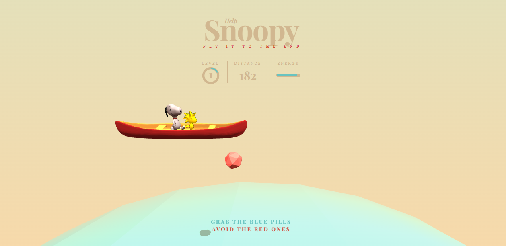
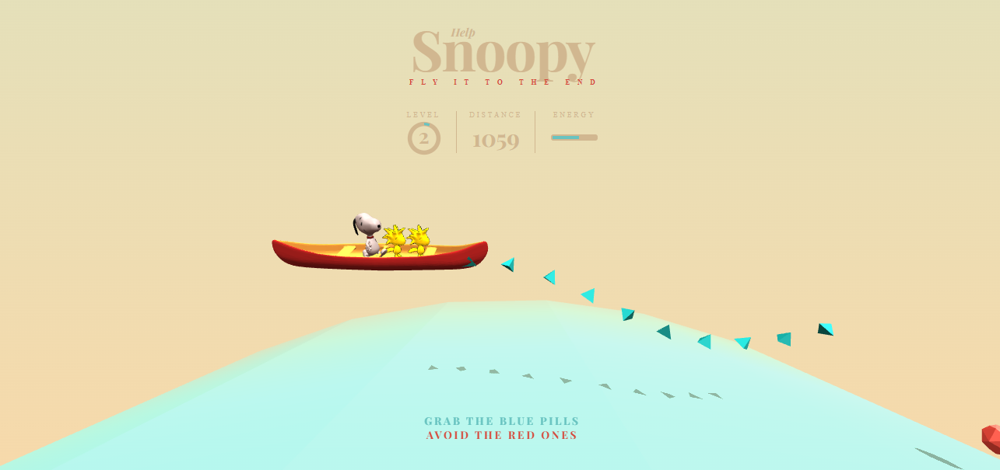

# Snoopy

Demos and game for the tutorial "The Making of 'Snoopy': Animating a Basic 3D Scene with Three.js", by Claire-Marie Alla.

[Article on Codrops](http://tympanus.net/codrops/?p=26501)

[Demo](http://tympanus.net/Tutorials/TheAviator/)

## License

Integrate or build upon it for free in your personal or commercial projects. Don't republish, redistribute or sell "as-is". 

Read more here: [License](http://tympanus.net/codrops/licensing/)

## Credits

- [Three.js](http://threejs.org/)
- [TweenMax](http://greensock.com)

## Idea of the interface

When a level is success, a woodstock is add on the boat.

## Improvement to make by future

That a woodstock is like a blue pills and when the boat catch the little bird, the bird is add on the boat.
When the boat is full, the player win.

